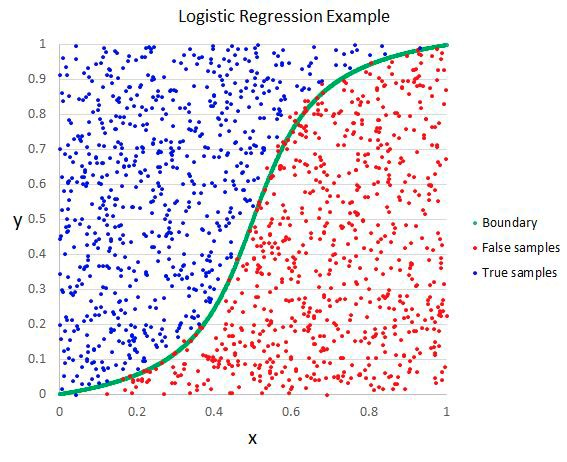

人工智能（Artificial Intelligence）、机器学习（Machine Learning）、深度学习（Deep Learning）、神经网络（Neutral Network）等等这些专业术语在平时学习和工作中经常出现，但有时感觉似懂非懂，傻傻分不清楚，所以决定在此简单的总结一下。

<!--more-->

从上图可以看出，**人工智能、机器学习、神经网络、深度学习之间是包含关系**，「人工智能」是最大的圈，它包括「机器学习」（机器根据数据“自学”）和「非机器学习」（机器从人直接获取指令）。「神经网络」是「机器学习」的一部分，它是由一个个「神经元」搭建的系统，多层的「神经网络」就叫做「深度学习」。

## 人工智能

**人工智能（Artificial Intelligence）是研究、开发用于模拟、延伸和扩展人的智能的理论、方法、技术及应用系统的一门技术科学。** 简单地说，就是给机器赋予人的智能。其基本原理：机器从「特定的」大量数据中总结规律，形成某些「特定的知识」，然后将这种「知识」应用到现实场景中去解决实际问题。

人工智能可分三个级别：
1. **弱人工智能**：限定领域解决特定问题。
2. **强人工智能**：通用领域胜任人类所有工作。
3. **超人工智能**：远超人类智慧。

我们现在还处在弱人工智能阶段，强人工智能还远没有实现，而超人工智能更是连影子都看不到。

## 机器学习

**机器学习（Machine Learning）是一门多领域交叉学科，涉及概率论、统计学、逼近论、凸分析、算法复杂度理论等多门学科。** 机器学习是人工智能的核心，是使计算机具有智能的根本途径，最基本的做法是使用算法解析数据、从中学习，然后对真实世界中的事件作出决策或预测。

## 机器学习分类

按模型训练方式分：
* 监督学习（Supervised Learning）
* 无监督学习（Unsupervised Learning）
* 半监督学习（Semi-supervised Learning）
* 强化学习（Reinforcement Learning）

### 监督学习

监督学习（Supervised Learning）是从有标记的训练数据中推导出预测函数，需要有明确的目标，清楚自己想要什么结果。简言之：**给定数据，预测标签。**

监督并不是人站在机器旁边看机器做的对不对，而是下面的流程：
1. 选择合适的模型
2. 把已知的“问题和答案”（训练集）提供给机器去学习
3. 机器总结出自己的“方法论”
4. 把“新的问题”（测试集）提供给机器去解答

监督学习的特点：
* 目标明确
* 需要带标签的训练数据
* 效果容易评估

监督学习主要任务：
* **回归**：预测连续的、具体的数值
* **分类**：对各种事物分类，用于离散型预测

### 无监督学习

无监督学习（Unsupervised Learning）本质上是一种统计手段，在没有标签的数据里发现潜在的一些结构的训练方法。简言之：**给定数据，寻找隐藏的结构。**

无监督学习的特点：
* 没有明确的目的
* 不需要给数据打标签
* 无法量化效果

无监督学习应用场景：
* 发现异常数据
* 细分用户
* 给用户做推荐

无监督学习主要任务:
* **聚类**：简单说就是一种自动分类的方法，在监督学习中，你很清楚每一个分类是什么，但是聚类则不是，你并去清楚聚类后的每个分类代表什么意思。
* **降维**：感觉像是压缩，是为了在尽可能保存相关的结构的同时降低数据的复杂度。

### 半监督学习

半监督学习（Semi-supervised Learning）属于无监督学习和监督学习之间，使用标记和未标记的数据来执行有监督学习或者无监督学习任务。

### 强化学习

强化学习（Reinforcement Learning）主要基于决策进行训练，根据输出结果（决策）的成功或失败来训练算法，通过大量经验训练优化后的算法将能够给出较好的预测。简言之：**给定数据，学习如何选择一系列行动，以最大化长期收益。**

强化学习特点：
* 决策流程
* 激励系统
* 学习一系列的行动

强化学习主要任务：
* **科学决策**：优化决策以得到最佳结果。
* **动态规划**：把复杂问题分解成若干个子问题，通过寻找子问提的最优解来得到复杂问题的最优解。

## 机器学习任务

最常见的机器学习任务有三种：
* 回归（Regression）
* 分类（Classification）
* 聚类（Clustering）

### 回归

回归算法是一种对数值型连续随机变量进行预测和建模的监督学习方法。使用案例包括房价预测、股票走势或测试成绩等连续变化的案例。

回归任务的特点是标注的数据集具有数值型的目标变量。也就是说，每一个观察样本都有一个数值型的标注真值以监督算法。

#### 线性回归

线性回归（Linear Regression）是处理回归任务最常用的算法之一。该算法的形式十分简单，它期望使用一个超平面拟合数据集（只有两个变量的时候就是一条直线）。如果数据集中的变量存在线性关系，那么其就能拟合地非常好。

在实践中，简单的线性回归通常被使用正则化的回归方法（LASSO、Ridge 和 Elastic-Net）所代替。正则化其实就是一种对过多回归系数采取惩罚以减少过拟合风险的技术。当然，我们还得确定惩罚强度以让模型在欠拟合和过拟合之间达到平衡。

* 优点：线性回归的理解与解释都十分直观，并且还能通过正则化来降低过拟合的风险。另外，线性模型很容易使用随机梯度下降和新数据更新模型权重。
* 线性回归在变量是非线性关系的时候表现很差。并且其也不够灵活以捕捉更复杂的模式，添加正确的交互项或使用多项式很困难并需要大量时间。

#### 回归树

回归树（Regression Tree）（回归决策树，决策树的一种）通过将数据集重复分割为不同的分支而实现分层学习，分割的标准是最大化每一次分离的信息增益。这种分支结构让回归树很自然地学习到非线性关系。

单一的回归树往往是不够用的，可以利用集成学习中的boosting框架对回归树进行改良升级，如梯度提升树（Gradient Boost Decision Tree）就是集成了许多独立训练的树。这种算法的主要思想就是组合多个弱学习算法而成为一种强学习算法，不过这里并不会具体地展开。在实践中 RF 通常很容易有出色的表现，而 GBM 则更难调参，不过通常梯度提升树具有更高的性能上限。

* 优点：决策树能学习非线性关系，对异常值也具有很强的鲁棒性。集成学习在实践中表现非常好，其经常赢得许多经典的（非深度学习）机器学习竞赛。

* 缺点：无约束的，单棵树很容易过拟合，因为单棵树可以保留分支（不剪枝），并直到其记住了训练数据。集成方法可以削弱这一缺点的影响。

#### 深度学习

深度学习（Deep Learning）是指能学习极其复杂模式的多层神经网络。该算法使用在输入层和输出层之间的隐藏层对数据的中间表征建模，这也是其他算法很难学到的部分。

深度学习还有其他几个重要的机制，如卷积和 drop-out 等，这些机制令该算法能有效地学习到高维数据。然而深度学习相对于其他算法需要更多的数据，因为其有更大数量级的参数需要估计。

* 优点：深度学习是目前某些领域最先进的技术，如计算机视觉和语音识别等。深度神经网络在图像、音频和文本等数据上表现优异，并且该算法也很容易对新数据使用反向传播算法更新模型参数。它们的架构（即层级的数量和结构）能够适应于多种问题，并且隐藏层也减少了算法对特征工程的依赖。

* 缺点：深度学习算法通常不适合作为通用目的的算法，因为其需要大量的数据。实际上，深度学习通常在经典机器学习问题上并没有集成方法表现得好。另外，其在训练上是计算密集型的，所以这就需要更富经验的人进行调参（即设置架构和超参数）以减少训练时间。

### 分类

分类方法是一种对离散型随机变量建模或预测的监督学习算法。使用案例包括邮件过滤、金融欺诈和预测雇员异动等输出为类别的任务。

许多回归算法都有与其相对应的分类算法，分类算法通常适用于预测一个类别（或类别的概率）而不是连续的数值。

#### 分类树

分类树（Classification Tree）（分类决策树，和回归树对应也是决策树的一种）。
相应的，随机森林（Random Forest）是分类树的一种集成形式。

* 优点：同回归方法一样，分类树的集成方法在实践中同样表现十分优良。它们通常对异常数据具有相当的鲁棒性和可扩展性。因为它的层级结构，分类树的集成方法能很自然地对非线性决策边界建模。

* 缺点：不可约束，单棵树趋向于过拟合，使用集成方法可以削弱这一方面的影响。

#### 逻辑回归

逻辑回归（Logistic Regression）是与线性回归相对应的一种分类方法，一般用于需要明确输出的场景，如某些事件的发生（预测是否会发生降雨）。通常，逻辑回归使用某种函数将概率值压缩到某一特定范围。逻辑回归通过逻辑函数（即Sigmoid函数）将预测映射到0到1中间，因此预测值就可以看成某个类别的概率。

该模型仍然还是「线性」的，所以只有在数据是线性可分（即数据可被一个超平面完全分离）时，算法才能有优秀的表现。同样 Logistic 模型能惩罚模型系数而进行正则化。

* 优点：输出有很好的概率解释，并且算法也能正则化而避免过拟合。Logistic 模型很容易使用随机梯度下降和新数据更新模型权重。

* 缺点：Logistic 回归在多条或非线性决策边界时性能比较差。

#### k-最近邻算法

k-最近邻算法（k-Nearest Neighbor, KNN）是一种基本分类和回归方法，即给定一个训练数据集，对新的输入实例，在训练数据集中找到与该实例最邻近的k个实例，这k个实例的多数属于某个类，就把该输入实例分到这个类中。用最近的邻居（k）来预测未知数据点。k值是预测精度的一个关键因素，无论是分类还是回归，衡量邻居的权重都非常有用，较近邻居的权重比较远邻居的权重大。

用KNN算法给新输入的实例分类，只要找到离它最近的k个实例，看哪个类别多即可。而k值的选取，既不能太小，也不能太大，需要实验调整参数确定。

* 优点：简单好用，容易理解，精度高，可用于数值型和离散型数据。
* 缺点：对数据的局部结构非常敏感，计算量大，需要对数据进行规范化处理，使每个数据点都在相同的范围。

#### 支持向量机

支持向量机（Support Vector Machine, SVM）可以使用一个称之为核函数的技巧扩展到非线性分类问题，而该算法本质上就是计算两个称之为支持向量的观测数据之间的距离。SVM 算法寻找的决策边界即最大化其与样本间隔的边界，因此支持向量机又称为大间距分类器。需要注意的是，支持向量机需要对输入数据进行完全标记，仅直接适用于两类任务，应用到多类任务时需要将其减少到几个二元问题。

SVM使用线性核函数就能得到类似于logistic回归的结果，只不过支持向量机因为最大化了间隔而更具鲁棒性。因此，在实践中，SVM最大的优点就是可以使用非线性核函数对非线性决策边界建模。

* 优点：SVM 能对非线性决策边界建模，并且有许多可选的核函数形式。SVM同样面对过拟合有相当大的鲁棒性，这一点在高维空间中尤其突出。
* 缺点：然而，SVM是内存密集型算法，由于选择正确的核函数是很重要的，所以其很难调参，也不能扩展到较大的数据集中。目前在工业界中，随机森林通常优于支持向量机算法。

#### 朴素贝叶斯

朴素贝叶斯（Naive Bayes）是一种基于贝叶斯定理和特征条件独立假设的分类方法。本质上朴素贝叶斯模型就是一个概率表，其通过训练数据更新这张表中的概率。为了预测一个新的观察值，朴素贝叶斯算法就是根据样本的特征值在概率表中寻找最大概率的那个类别。之所以称之为「朴素」，是因为该算法的核心就是特征条件独立性假设（每一个特征之间相互独立），而这一假设在现实世界中基本是不现实的。

$P(y|x_1,...,x_n)=\frac{P(y)\prod(^n_{i=1}P(x_i|y)))}{P(x_1,...,x_n)}$

* 优点：即使条件独立性假设很难成立，但朴素贝叶斯算法在实践中表现出乎意料地好。该算法很容易实现并能随数据集的更新而扩展。
* 缺点：因为朴素贝叶斯算法太简单了，所以其也经常被以上列出的分类算法所替代。

#### 深度学习

深度学习（Deep Learning）同样很容易适应于分类问题。实际上，深度学习应用更多的是分类任务，如图像分类等。

* 优点：深度学习非常适用于分类音频、文本和图像数据。
*缺点：和回归问题一样，深度神经网络需要大量的数据进行训练，所以其也不是一个通用目的的算法。

### 聚类

聚类是一种无监督学习任务，该算法基于数据的内部结构寻找观察样本的自然族群（即集群）。使用案例包括细分客户、新闻聚类、文章推荐等。

因为聚类是一种无监督学习（即数据没有标注），并且通常使用数据可视化评价结果。如果存在「正确的回答」（即在训练集中存在预标注的集群），那么分类算法可能更加合适。

#### k均值聚类

k均值聚类（K-Means Clustering）是一种通用目的的算法，聚类的度量基于样本点之间的几何距离（即在坐标平面中的距离）。集群是围绕在聚类中心的族群，而集群呈现出类球状并具有相似的大小。

K-Means算法把n个点（可以是样本的一次观察或一个实例）划分到k个集群（cluster），使得每个点都属于离他最近的均值（即聚类中心，centroid）对应的集群。重复上述过程一直持续到重心不改变。

* 优点：K 均值聚类是最流行的聚类算法，因为该算法足够快速、简单，并且如果你的预处理数据和特征工程十分有效，那么该聚类算法将拥有令人惊叹的灵活性。
* 缺点：该算法需要指定集群的数量，而 K 值的选择通常都不是那么容易确定的。另外，如果训练数据中的真实集群并不是类球状的，那么 K 均值聚类会得出一些比较差的集群。

#### 层次聚类

层次聚类（Hierarchical Clustering）通过计算不同类别数据点之间的相似度来创建一棵有层次的嵌套聚类树，在聚类树中，不同类别的原始数据点是树的最底层，树的顶层是一个聚类的根节点。创建聚类树有自下而上合并和自上而下分裂两种方法，常见的是合并方法。

层次聚类的合并算法是通过计算每一个类别的数据点与所有数据点之间的距离来确定它们之间的相似性，距离越小，相似度越高。并将距离最近的两个数据点或类别进行组合，生成聚类树。

* 优点：层次聚类最主要的优点是集群不再需要假设为类球形。另外其也可以扩展到大数据集。
* 缺点：有点像k均值聚类，该算法需要设定集群的数量（即在算法完成后需要保留的层次）。

## 神经网络

神经网络（Neural Networks)是人工智能领域机器学习一部分，就好像人体的神经元、神经系统一样，人工智能的神经网络就是由一个个神经元搭建的系统，多层的神经网络就叫做深度神经网络（Deep Neural Network, **DNN**），也就是深度学习。它是机器学习最重要的一个分支，也是最流行一种的机器学习算法！

DNN已经演变成许多不同的网络拓扑结构，比如，卷积神经网络（Convolutional Neural Networks, **CNN**）、循环神经网络（Recurrent Neural Networks, **RNN**）、长短期记忆（Long Short Term Memory, **LSTM**）、生成敌对网络（Generativ Adversarial Networks, **GAN**）等。

---

## 参考

1. [人工智能相关知识](https://easyai.tech/ai-definition/ai/)
2. [回归、分类与聚类](https://www.jiqizhixin.com/articles/2017-05-20-3)
3. [Machine Learning:十大机器学习算法](https://zhuanlan.zhihu.com/p/33794257)
4. [Understanding Neutral Networks](https://towardsdatascience.com/understanding-neural-networks-from-neuron-to-rnn-cnn-and-deep-learning-cd88e90e0a90)