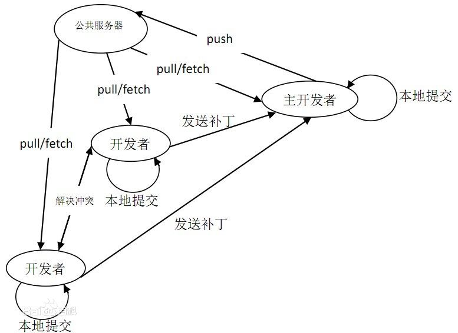
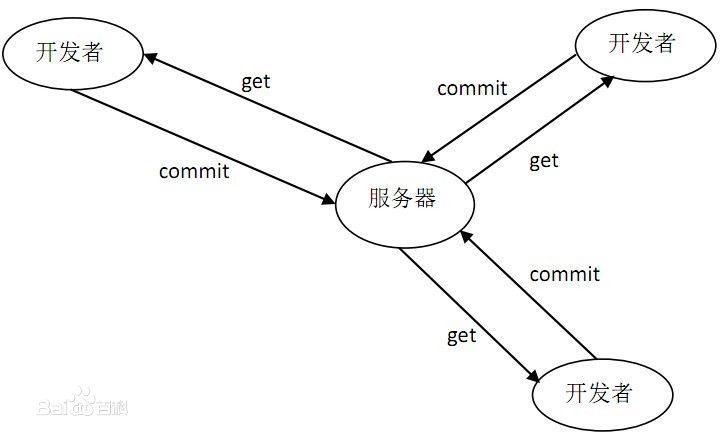

本文主要介绍git和svn的区别与作用。

<!-- more -->

## GIT

git是一个应用最广泛的免费的、开源的分布式版本控制系统，github是最常用的提供远程git仓库托管服务的网站。git与常用的集中式版本控制工具Subversion(svn)不同，它采用了分布式版本库的方法，不依赖服务器端软件支持，其最大特点在于开发者可以提交到本地，每个开发者通过克隆（git clone），在本地拷贝一个完整的git仓库。

**工作流程：**

下图是经典的git开发过程。

**功能特性：**

从一般开发者的角度来看，git有以下功能：

　1．从服务器上克隆完整的Git仓库（包括代码和版本信息）到单机上。
　2．在自己的机器上根据不同的开发目的，创建分支，修改代码。
　3．在单机上自己创建的分支上提交代码。
　4．在单机上合并分支。
　5．把服务器上最新版的代码fetch下来，然后跟自己的主分支合并。
　6．生成补丁（patch），把补丁发送给主开发者。
　7．看主开发者的反馈，如果主开发者发现两个一般开发者之间有冲突（他们之间可以合作解决的冲突），就会要求他们先解决冲突，然后再由其中一个人提交。如果主开发者可以自己解决，或者没有冲突，就通过。
　8．一般开发者之间解决冲突的方法，开发者之间可以使用pull 命令解决冲突，解决完冲突之后再向主开发者提交补丁。
  
从主开发者的角度看（假设主开发者不用开发代码），git有以下功能：

　1．查看邮件或者通过其它方式查看一般开发者的提交状态。
　2．打上补丁，解决冲突（可以自己解决，也可以要求开发者之间解决以后再重新提交，如果是开源项目，还要决定哪些补丁有用，哪些不用）。
　3．向公共服务器提交结果，然后通知所有开发人员。 

## SVN

SVN是Subversion的简称，是一个开源的版本控制系统，支持大多数常见的操作系统。作为一个开源的版本控制系统，Subversion管理着随时间改变的数据，这些数据放置在一个中央资料档案库（repository）中，这个档案库很像一个普通的文件服务器,不过它会记住每一次文件的变动，这样你就可以把档案恢复到旧的版本，或是浏览文件的变动历史。Subversion是一个通用的系统,可用来管理任何类型的文件，其中包括程序源码。

**工作流程：**

集中式管理的工作流程如下图：

集中式代码管理的核心是服务器，所有开发者在开始新一天的工作之前必须从服务器获取代码，然后开发，最后解决冲突，提交。所有的版本信息都放在服务器上。如果脱离了服务器，开发者基本上可以说是无法工作的。

**功能特性：**

　1．从服务器下载项目组最新代码。
　2．进入自己的分支，进行工作，每隔一个小时向服务器自己的分支提交一次代码（很多人都有这个习惯，因为有时候自己对代码改来改去，最后又想还原到前一个小时的版本，或者看看前一个小时自己修改了哪些代码，就需要这样做了）。
　3．下班时间快到了，把自己的分支合并到服务器主分支上，一天的工作完成，并反映给服务器。

## 区别

1. 适用对象不同。Git适用于参与开源项目的开发者，他们由于水平高，更在乎的是效率而不是易用性。SVN则不同，它适合普通的公司开发团队，使用起来更加容易。

2. 使用的场合不同。Git适用于通过Internet，有多个开发角色的单个项目开发。SVN适合企业内部由项目经理统一协调的多个并行项目的开发。

3. 权限管理策略不同。Git没有严格的权限管理控制，只要有帐号，就可以导出、导入代码，甚至执行回退操作。SVN则有严格的权限管理，可以按组、按个人进行针对某个子目录的权限控制，区分读、写权限。更严格的，不支持回退操作，保证代码永远可以追踪。

4. 分支（branch）的使用范围不同。Git中，你只能针对整个仓库作branch，而且一旦删除，便无法恢复。而SVN中，branch可以针对任何子目录，它本质上是一个拷贝操作，所以，可以建立非常多、层次性的branch，并且，在不需要时将其删除，而以后需要时只要checkout老的SVN版本就可以了。

5. 基于第三点，Git适用于单纯的软件项目，典型的就是一些开源项目，比如Linux内核、busybox等。相反，SVN擅长多项目管理。比如，你可以在一个SVN仓库中存放一个手机项目的bsp/设计文档/文件系统/应用程序/自动化编译脚本，或者在一个SVN中存放5款手机项目的文件系统。git中必须建立n（项目数）* m（组件数）个仓库。SVN中只需要最多n或者m个就可以了。

6. Git使用128位ID作为版本号，而且checkout时要注明是哪个branch，而SVN使用一个递增的序列号作为全局唯一的版本号，更加简明易懂。虽然可以使用gittag来建立一些文字化的别名，但是毕竟那只是针对特殊版本。

7. 可跟踪性，git的典型开发过程为：建立分支，进行开发，提交到本地master，删除分支。这样做的后果是以前的修改细节会丢失。而在SVN下做同样的事情，不会丢失任何细节。这里是一个有趣的链接，表明了git下典型的工作方式：（以master为核心，不断创建新branch，删除旧branch)。

8. 局部更新，局部还原。SVN由于是在每个文件夹建立一个.svn文件夹来实现管理，所以可以很简单实现局部更新或者还原。假如你只希望更新某些部分，则svn可以很好实现。同时代码写错了，同时可以很好实现局部还原，当然git也可以通过历史版本还原，但是无法简单地实现局部还原。

## 总结

公司的开发团队在进行项目开发管理时，svn是更好的选择，团队成员共同维护公司的中心版本。若是开源项目，则git更加适合，每个人都可以维护自己专属的版本，同时有github开源社区支持。

---

## 参考

1. [github官网](https://docs.github.com/en/github)
2. [百度百科-git](https://baike.baidu.com/item/GIT/12647237#3)
3. [SVN和GIT介绍，区别，使用](https://blog.csdn.net/mine_song/article/details/70770467)
